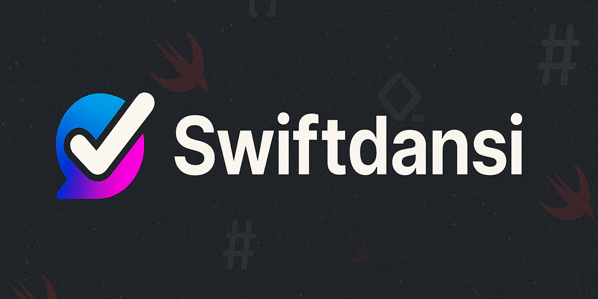

# 🎨 Swiftdansi: Wraps, colors, links—no baggage.

<p align="center">
  
</p>

<p align="center">
  <a href="LICENSE"></a>
  <a href="https://www.swift.org"></a>
  <a href="https://www.apple.com/macos/"></a>
  <a href="https://www.apple.com/ios/"></a>
  <a href="https://www.apple.com/tvos/"></a>
  <a href="https://www.apple.com/watchos/"></a>
  <a href="https://www.apple.com/visionos/"></a>
</p>

Swift 6.2 Markdown → ANSI renderer and CLI, modeled on [Markdansi](https://github.com/steipete/Markdansi) but built with `swift-markdown` + `swift-displaywidth`. Fast, zero runtime deps, Apple platforms only (macOS 15+, iOS 18+, tvOS 18+, watchOS 11+, visionOS 2+).

## Features
- GFM blocks & inline: headings, lists/tasks, blockquotes, code (boxed/labels/gutter), tables (align/pad/dense/truncate/ellipsis), HR, strike, links/autolinks, inline code, emphasis/strong.
- OSC‑8 hyperlinks with auto-detect + force/disable flags; plain suffix fallback when color off.
- Unicode-aware width/wrapping (emoji, CJK) using swift-displaywidth.
- Themes: default, dim, bright, solarized, monochrome, contrast; custom theme support.
- Highlighter hook: inject your own ANSI coloring for fenced code.
- CLI parity with Markdansi flags, plus `--force-links`.

## Install
SwiftPM package:
```swift
.package(url: "https://github.com/steipete/Swiftdansi.git", from: "0.1.0")
```
Targets: `Swiftdansi` (library), `swiftdansi` (CLI binary).

## Library usage
```swift
import Swiftdansi

// One-off render
let ansi = render("# Hello **world**", options: RenderOptions(width: 60))

// Reusable renderer
let renderNoWrap = createRenderer(options: RenderOptions(wrap: false))
let out = renderNoWrap("A very long line without wrapping")

// Plain text (no ANSI/OSC)
let plain = strip("link to [x](https://example.com)")

// Custom theme & highlighter
let custom = createRenderer(options: RenderOptions(
    theme: .bright,
    highlighter: { code, _ in code.uppercased() }
))
```

### Options (RenderOptions)
- `wrap` (default `true`), `width` (TTY cols or 80 when wrapping).
- `color` (default TTY), `hyperlinks` (auto when color on), `force-links` / `no-links` via CLI.
- `theme`: `.default | .dim | .bright | .solarized | .monochrome | .contrast` or `customTheme`.
- Lists: `listIndent` (default 2), `listMarker` (default `-`, set to `"•"` for dotted lists like Markdansi).
- Quotes: `quotePrefix` (default `│ `).
- Tables: `tableBorder unicode|ascii|none`, `tablePadding`, `tableDense`, `tableTruncate`, `tableEllipsis`.
- Code: `codeBox`, `codeGutter`, `codeWrap`.
- `highlighter` `(code, lang?) -> String`.

## CLI
```
swiftdansi [--in FILE] [--out FILE] [--width N] [--no-wrap] [--no-color] [--no-links] [--force-links]
          [--theme default|dim|bright|solarized|monochrome|contrast]
          [--list-indent N] [--quote-prefix STR]
          [--table-border unicode|ascii|none] [--table-padding N] [--table-dense]
          [--table-truncate[=true|false]] [--table-ellipsis STR]
          [--code-wrap[=true|false]] [--code-box[=true|false]] [--code-gutter]
```
- Input: stdin if `--in` missing or `-`; output: stdout unless `--out`.
- Hyperlinks: auto-detect when color on; override with `--force-links` or `--no-links`.
- Handles SIGPIPE for pipelines.

## Development
- Build: `swift build` (or `pnpm build`)
- Test: `swift test` (or `pnpm test`)
- Lint: `pnpm lint` (SwiftLint, config in `.swiftlint.yml`)
- Format: `pnpm format` (SwiftFormat, config in `.swiftformat`)

## Testing & CI
- Tests (Swift-Testing): `swift test`
- CI: `.github/workflows/ci.yml` runs `swift test` on macOS 15.

## License
MIT

## Inspiration
Built as a Swift port of [Markdansi](https://github.com/steipete/Markdansi); see that project for the original TypeScript implementation and behavior notes.
